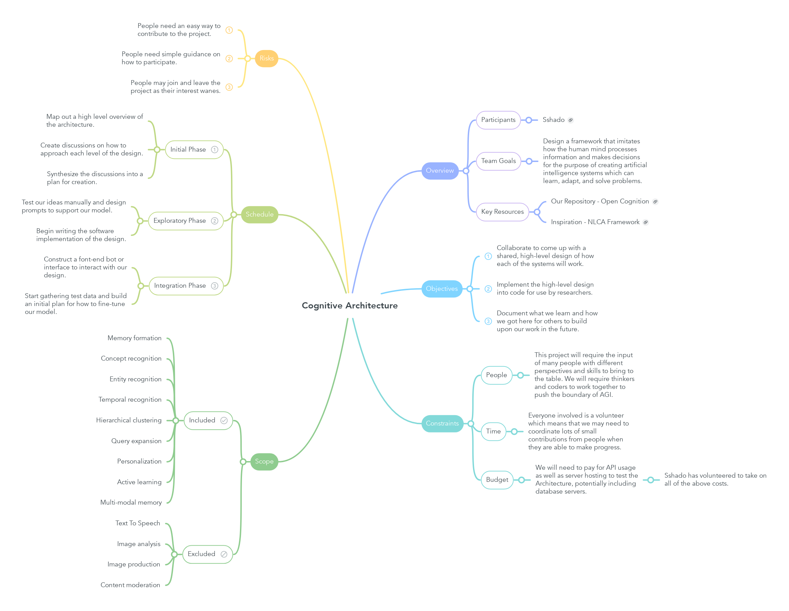

# Cognitive Architecture

## Overview

### Participants

#### Sshado

Link: [https://github.com/AlexanderJohnston](https://github.com/AlexanderJohnston)

### Team Goals

#### Design a framework that imitates how the human mind processes information and makes
decisions for the purpose of creating artificial intelligence systems which can learn, adapt, and solve
problems.

### Key Resources

#### Our Repository - Open Cognition

Link: [https://github.com/AlexanderJohnston/open-cognition/blob/main/README.md](https://github.com/AlexanderJohnston/open-cognition/blob/main/README.md)

#### Inspiration - NLCA Framework

Link: [https://github.com/daveshap/NaturalLanguageCognitiveArchitecture](https://github.com/daveshap/NaturalLanguageCognitiveArchitecture)

## Objectives

1. Collaborate to come up with a shared, high-level design of how each of the systems will work.
2. Implement the high-level design into code for use by researchers.
3. Document what we learn and how we got here for others to build upon our work in the future.

## Constraints

### People

#### This project will require the input of many people with different perspectives and skills to bring to
the table. We will require thinkers and coders to work together to push the boundary of AGI.

### Time

#### Everyone involved is a volunteer which means that we may need to coordinate lots of small
contributions from people when they are able to make progress.

### Budget

#### We will need to pay for API usage as well as server hosting to test the Architecture, potentially
including database servers.

##### Sshado has volunteered to take on all of the above costs.

## Scope

### Included

1. Memory formation
2. Concept recognition
3. Entity recognition
4. Temporal recognition
5. Hierarchical clustering
6. Query expansion
7. Personalization
8. Active learning
9. Multi-modal memory

### Excluded

1. Text To Speech
2. Image analysis
3. Image production
4. Content moderation

## Schedule

### Initial Phase

1. Map out a high level overview of the architecture.
2. Create discussions on how to approach each level of the design.
3. Synthesize the discussions into a plan for creation.

### Exploratory Phase

1. Test our ideas manually and design prompts to support our model.
2. Begin writing the software implementation of the design.

### Integration Phase

1. Construct a font-end bot or interface to interact with our design.
2. Start gathering test data and build an initial plan for how to fine-tune our model.

## Risks

1. People need an easy way to contribute to the project.
2. People need simple guidance on how to participate.
3. People may join and leave the project as their interest wanes.
